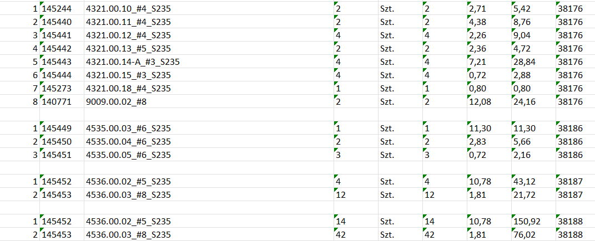

<h1>OrderHub</h1>

Script has been designed to automate the order processing when multiple
order files are received.
 
Key features of the script:

1. Extraction data such as order number, part numbers, part names, quantity, and cost
from multiple tables in multiple order files and creating collection document through tablerReader module.
2. Creating checklist through checklist module to make collection easier.
3. Dividing and sorting drawings by order, and raw material type that need to be used in production
4. Creating and reading log of performed tasks
 

Implemented modules:

<h2>Table reader</h2>

Script created to automate work with multiple order files. 
Main reason to create this script was to automate the monotonous 
work of creating the stock issue confirmation document.
 
Script is able to scrape information from .doc and .docx order documents
 
and create output .xlsx spreadsheet with data as table ready to be copied to CI document.
 

Script significantly reduced the working time with client orders.

Sample output file:

